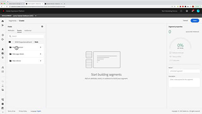

# Självstudiekurser för Audience Manager

Välkommen till självstudiewebbplatsen för Audience Manager. Använd dessa självstudiekurser tillsammans med [dokumentation](https://experienceleague.adobe.com/docs/audience-manager/user-guide/aam-home.html) ger er en bättre förståelse för hur ni kan använda Adobe Audience Manager för att skapa och aktivera målgrupper i alla kanaler och enheter med hjälp av Adobe i toppklass [!DNL data management platform].

* Se **&quot;What&#39;s New&quot;** för de senaste uppdateringarna och funktionerna
* **Personalval** markerar en del av vårt favoritinnehåll
* Utforska innehållet efter ämne och ämne i **vänster navigering**
* Använd **sök** fältet längst upp på sidan om du vet vad du letar efter

## Personalval

<table>
<tr>
  <td>
    
    

      <a href="https://experienceleague.adobe.com/docs/platform-learn/implement-web-sdk/overview.html">
    <strong>Implementera Adobe Experience Cloud med Web SDK, genomgång</strong>
    </a>
    

    

    <em>Lär dig hur du implementerar Experience Cloud-program med Adobe Experience Platform Web SDK.</em>
    

  </td>
  <td>
    
    

      <a href="https://experienceleague.adobe.com/docs/audience-manager-learn/tutorials/other-integrations/integrating-with-rtcdp/rtcdp-segments-for-aam-users.html">
    <strong>Förstå segment i CDP för Audience Manager i realtid</strong>
    </a>
    

    

    <em>I den här videon visas skillnaderna mellan segment och segmentskapande mellan Audience Manager och CDP i realtid.</em>
    

  </td>
  <td>
    
    

      <a href="https://experienceleague.adobe.com/docs/audience-manager-learn/tutorials/build-and-manage-audiences/algorithmic-models/configure-and-report-on-predictive-audiences.html">
    <strong>Konfigurera och rapportera om prediktiva målgrupper i Audience Manager</strong>
    </a>
    

    

    <em>I den här videon går vi igenom konfigurationen för prediktiva målgrupper i Audience Manager.</em>
    

  </td>
</tr>
</table>

