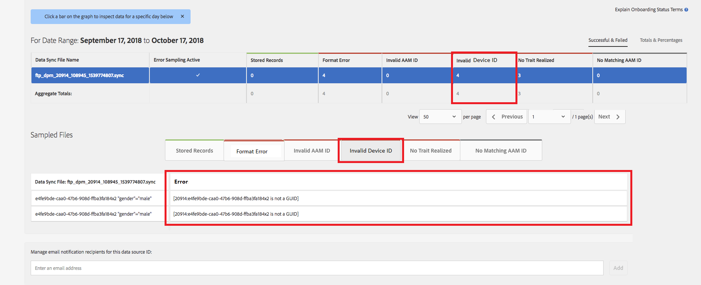

# Validering av globalt enhets-ID {#global-device-id-validation}

Identifierare för enhetsannonsering (dvs. iDFA, GAID, Roku ID) har formateringsstandarder som måste uppfyllas för att kunna användas i det digitala reklamekosystemet. Idag kan kunder och partners överföra ID:n till våra globala datakällor i vilket format som helst utan att meddelas om ID:t är korrekt formaterat. Den här funktionen kommer att implementera validering av enhets-ID:n som skickas till de globala datakällorna för korrekt formatering och kommer att ge felmeddelanden när ID:n är felaktigt formaterade. Vi kommer att stödja validering för [!DNL iDFA], [!DNL Google Advertising] och [!DNL Roku IDs] vid lansering.

## Översikt över formatstandarder {#overview-of-format-standards}

Följande är de globala ID-pooler för enhetsannonsering som för närvarande känns igen och stöds av AAM. Dessa implementeras som delade [!UICONTROL Data Sources] som kan användas av alla kunder eller datapartners som arbetar med data som är knutna till användare av dessa plattformar.

<table>
  <tr>
   <td>Plattform </td>
   <td>AAM-ID för datakälla </td>
   <td>ID-format </td>
   <td>AAM PID </td>
   <td>Anteckningar </td>
  </tr>
  <tr>
   <td>Google Android (GAID)</td>
   <td>20914</td>
   <td>32 hex-tal, vanligen presenterade som 8-4-4-4-12<em>exempel, 97987bca-ae59-4c7d-94ba-ee4f19ab8c21  </em> </td>
   <td>1352</td>
   <td>Detta ID måste samlas in i en obearbetad/ohashed/oändrad formulärreferens - <a href="https://play.google.com/about/monetization-ads/ads/ad-id/">https://play.google.com/about/monetization-ads/ads/ad-id/</a></td>
  </tr>
  <tr>
   <td>Apple iOS (IDFA)</td>
   <td>20915</td>
   <td>32 hex-tal, vanligen presenterade som 8-4-4-4-12 <em>exempel, 6D92078A-8246-4BA4-AE5B-76104861E7DC  </em> </td>
   <td>3560</td>
   <td>Detta ID måste samlas in i en obearbetad/ohashed/oändrad formulärreferens - <a href="https://support.apple.com/en-us/HT205223">https://support.apple.com/en-us/HT205223</a></td>
  </tr>
  <tr>
   <td>Roku (RIDA)</td>
   <td>121963</td>
   <td>32 hex-tal, vanligen presenterade som 8-4-4-4-12 <em>exempel,</em> <em>fcb2a29c-315a-5e6b-bcfd-d889ba19ada</em></td>
   <td>11536</td>
   <td>Detta ID måste samlas in i en obearbetad/ohashed/oändrad formulärreferens - <a href="https://sdkdocs.roku.com/display/sdkdoc/Roku+Advertising+Framework">https://sdkdocs.roku.com/display/sdkdoc/Roku+Advertising+Framework</a> </td>
  </tr>
  <tr>
   <td>Microsoft Advertising ID (MAID)</td>
   <td>389146</td>
   <td>Alfanumerisk sträng</td>
   <td>14593</td>
   <td>Detta ID måste samlas in i en obearbetad/ohashed/oändrad formulärreferens - <a href="https://docs.microsoft.com/en-us/uwp/api/windows.system.userprofile.advertisingmanager.advertisingid">https://docs.microsoft.com/en-us/uwp/api/windows.system.userprofile.advertisingmanager.advertisingid</a> <a href="https://msdn.microsoft.com/en-us/library/windows/apps/windows.system.userprofile.advertisingmanager.advertisingid.aspx">https://msdn.microsoft.com/en-us/library/windows/apps/windows.system.userprofile.advertisingmanager.advertisingid.aspx</a></td>
  </tr>
  <tr>
   <td>Samsung DUID</td>
   <td>404660</td>
   <td>Exempel på alfanumerisk sträng, 7XCBNROQJQPYW</td>
   <td>15950</td>
   <td>Detta ID måste samlas in i en obearbetad/ohashed/oändrad formulärreferens - <a href="https://developer.samsung.com/tv/develop/api-references/samsung-product-api-references/productinfo-api">https://developer.samsung.com/tv/develop/api-references/samsung-product-api-references/productinfo-api</a> </td>
  </tr>
</table>

## Ställa in en annonsidentifierare i appen {#setting-an-advertising-identifier-in-the-app}

Att ange annonser-ID i appen är i själva verket en tvåstegsprocess, att först hämta annonser-ID:t och sedan skicka det till Experience Cloud. Länkar finns nedan för att utföra dessa steg.

1. Hämta ID
   1. [!DNL Apple] information om [!DNL advertising ID] kan hittas [HÄR](https://developer.apple.com/documentation/adsupport/asidentifiermanager).
   1. Viss information om hur du ställer in [!DNL advertiser ID] for [!DNL Android] utvecklare kan hittas [HÄR](http://android.cn-mirrors.com/google/play-services/id.html).
1. Skicka in den till Experience Cloud med [!DNL setAdvertisingIdentifier] i SDK
   1. Information för användning `setAdvertisingIdentifier` finns i [dokumentation](https://aep-sdks.gitbook.io/docs/using-mobile-extensions/mobile-core/identity/identity-api-reference#set-an-advertising-identifier) för båda [!DNL iOS] och [!DNL Android].

`// iOS (Swift) example for using setAdvertisingIdentifier:`
`ACPCore.setAdvertisingIdentifier([AdvertisingId]) // ...where [AdvertisingId] is replaced by the actual advertising ID`

## Felmeddelanden för DCS för felaktiga ID:n  {#dcs-error-messaging-for-incorrect-ids}

När ett felaktigt ID för global enhet (IDFA, GAID osv.) skickas i realtid till Audience Manager returneras en felkod vid träffen. Följande är ett exempel på ett fel som returneras eftersom ID:t skickas som ett [!DNL Apple IDFA], som bara ska innehålla versaler, men ändå finns det ett gemener &quot;x&quot; i ID:t.

Se [dokumentation](https://experienceleague.adobe.com/docs/audience-manager/user-guide/api-and-sdk-code/dcs/dcs-api-reference/dcs-error-codes.html?lang=en#api-and-sdk-code) för listan över felkoder.

## Onboarding-ID för global enhet {#onboarding-global-device-ids}

Förutom att skicka in globala enhets-ID i realtid kan du även[!DNL onboard]&quot; (ladda upp) data även mot ID:n. Den här processen är densamma som när du registrerar data mot dina kund-ID:n (vanligtvis via nyckel/värde-par), men du använder bara rätt ID för datakälla så att data tilldelas till det globala enhets-ID:t. Dokumentation om introduktionsprocessen finns i [dokumentation](https://experienceleague.adobe.com/docs/audience-manager/user-guide/implementation-integration-guides/sending-audience-data/batch-data-transfer-process/batch-data-transfer-overview.html?lang=en#implementation-integration-guides). Kom ihåg att använda det globala ID:t för datakällan, beroende på vilken plattform du använder.

Om felaktiga globala enhets-ID:n skickas via introduktionsprocessen visas felen i [[!DNL Onboarding Status Report]](https://experienceleague.adobe.com/docs/audience-manager/user-guide/reporting/onboarding-status-report.html?lang=en#reporting).

Här följer ett exempel på ett fel som skulle uppstå i den rapporten:

