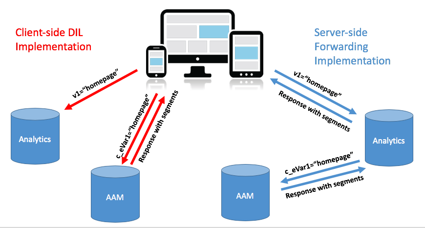

# Migrera implementeringen av din webbplats AAM från [!DNL Client-Side] DIL till [!DNL Server-Side Forwarding] {#migrating-your-site-s-aam-implementation-from-client-side-dil-to-server-side-forwarding}

Den här självstudiekursen gäller dig om du har både Adobe Audience Manager (AAM) och Adobe Analytics, och du för närvarande skickar en träff från sidan till AAM med&quot;DIL&quot; ([!DNL Data Integration Library])-kod, samt skickar en träff från sidan till Adobe Analytics. Eftersom ni har båda dessa lösningar, och eftersom de båda är en del av Adobe Experience Cloud, har ni möjlighet att följa den bästa metoden att aktivera&quot;[!DNL Server-Side Forwarding] (SSF)&quot;, som gör det möjligt för datainsamlingsservrarna att vidarebefordra webbplatsanalysdata i realtid till Audience Manager, i stället för att låta [!DNL Analytics] [!DNL client-side] koden skicka ytterligare en träff från sidan till AAM. I den här självstudiekursen får du hjälp med att gå över från den äldre&quot;[!DNL Client-Side DIL]&quot; implementeringen till den nyare&quot;[!DNL Server-Side forwarding]&quot; metoden.

## [!DNL Client-Side] (DIL) jämfört med [!DNL Server-Side] {#client-side-dil-vs-server-side}

När du jämför och kontrasterar dessa två metoder för att hämta in Adobe Analytics-data i AAM kan det först vara bra att visualisera skillnaderna i följande bild:

### [!DNL Client-side] Implementering av DIL {#client-side-dil-implementation}

Om du använder den här metoden för att hämta data från Adobe Analytics till AAM innebär det att du får två träffar från dina webbsidor: Den ena kommer [!DNL Analytics]och den andra kommer att AAM (efter att ha kopierat [!DNL Analytics] data på webbsidan). [!UICONTROL Segments] returneras från AAM till sidan, där de kan användas för personalisering osv. Detta betraktas som en &quot;äldre&quot; implementering och rekommenderas inte längre.

Förutom att detta inte följer bästa praxis, är nackdelarna med att använda denna metod bland annat:

* Två träffar på sidan istället för bara ett
* [!UICONTROL Server-Side Forwarding] krävs för att dela AAM målgrupper i realtid [!DNL Analytics][!DNL Client-side] så att implementeringar inte tillåter den här funktionen (och eventuellt andra funktioner i framtiden)

Vi rekommenderar att du går över till en [!UICONTROL Server-Side Forwarding] metod för AAM implementering.

### [!UICONTROL Server-Side Forwarding] Implementering {#server-side-forwarding-implementation}

Som framgår av bilden ovan kommer en träff från webbsidan till Adobe Analytics. [!DNL Analytics] skickar sedan informationen vidare till AAM i realtid och besökarna utvärderas till AAM [!UICONTROL traits] och [!UICONTROL segments]precis som om träffen hade kommit direkt från sidan.

[!UICONTROL Segments] returneras vid samma träff i realtid [!DNL Analytics]som vidarebefordrar svaret till webbsidan för personalisering osv.

Det finns ingen nedtid till att gå över till vidarebefordran på serversidan. Vi rekommenderar alla som har både Audience Manager och [!DNL Analytics] använder den här implementeringsmetoden.

## Du har två huvuduppgifter {#you-have-two-main-tasks}

Det finns en hel del information på den här sidan, och allt är förstås viktigt. Men **allt handlar om två saker som du måste göra**:

1. Ändra koden från [!DNL Client-Side] DIL till [!UICONTROL Server-Side Forwarding] kod
1. Vänd växeln i [!DNL Analytics] för [!DNL Admin Console] att starta den faktiska dataöverföringen (per [!UICONTROL report suite])

Om du hoppar över något av dessa två fungerar inte SSF korrekt. Steg och ytterligare data har lagts till i det här dokumentet för att hjälpa dig att göra de här två stegen på rätt sätt under installationen.

## Implementeringsalternativ {#implementation-options}

När du går vidare [!DNL client-side] till [!DNL server-side]den nya [!UICONTROL Server-Side Forwarding] koden är en av de uppgifter du kommer att ha. Detta görs med något av följande alternativ:

* Adobe Experience Platform Launch - Vi rekommenderar implementeringsalternativ för webbegenskaper. Du kommer att se att det här är en väldigt enkel uppgift, precis som [!DNL Launch] med allt det som är svårt för dig.
* På sidan - Du kan också placera den nya SSF-koden direkt i `doPlugins` funktionen i [!DNL appMeasurement.js] filen, om du inte (än) använder Adobe Launch
* Andra tagghanterare - Dessa kan behandlas på samma sätt som föregående (på sidan) alternativ, eftersom du fortfarande placerar SSF-koden i `doPlugins`, oavsett var den andra tagghanteraren lagrar [!DNL AppMeasurement] koden

Vi tittar närmare på dessa nedan i avsnittet Uppdatera koden.

## Implementeringssteg {#implementation-steps}

### Steg 0: Krav: Experience Cloud ID-tjänst (ECID) {#step-prerequisite-experience-cloud-id-service-ecid}

Den viktigaste förutsättningen för att gå över till [!UICONTROL Server-Side Forwarding] är att Experience Cloud ID-tjänsten är implementerad. Detta är enklast om du använder Experience Platform Launch, och då installerar du bara ECID-tillägget så gör det resten.

Om du använder ett TMS som inte är Adobe eller inte har något TMS alls måste du implementera ECID för att köra **före** andra Adobe-lösningar. Mer information finns i [ECID-dokumentationen](https://marketing.adobe.com/resources/help/en_US/mcvid/) . Den enda andra förutsättningen är kodversioner, så när du bara använder de senaste versionerna av koden i följande steg kommer du att klara dig.

>[!NOTE]
>
>Läs hela dokumentet innan du implementerar det. Avsnittet&quot;Timing&quot; nedan innehåller viktig information om *när* du ska implementera varje del, inklusive ECID (om det ännu inte implementerats).

### Steg 1: Registrera alternativ som används från DIL-kod {#step-record-currently-used-options-from-dil-code}

När du är redo att gå från [!DNL Client-Side] DIL till [!UICONTROL Server-Side Forwarding]är det första steget att identifiera allt du gör med DIL-kod, inklusive anpassade inställningar och data som skickas till AAM. Några saker att tänka på:

* Normala [!DNL Analytics] variabler med modulen [!DNL siteCatalyst.init] DIL - du behöver inte bekymra dig om den här, eftersom det är bara att skicka de normala [!DNL Analytics] variablerna över, och det kommer att hända om du bara har SWF aktiverat.
* Deldomän för partner - I funktionen DIL.create kan du anteckna `partner` parametern. Detta kallas din&quot;partnerunderdomän&quot; eller ibland&quot;partner-ID&quot; och kommer att behövas när du monterar den nya SSF-koden.
* [!DNL Visitor Service Namespace] - Kallas även&quot;[!DNL Org ID]&quot; eller&quot;[!DNL IMS Org ID]&quot; när du skapar den nya SSF-koden. Notera det.
* containerNSID, uidCookie och andra avancerade alternativ - Anteckna eventuella ytterligare avancerade alternativ som du använder så att du även kan ange dem i SSF-koden.
* Ytterligare sidvariabler - Om andra variabler skickas till AAM från sidan (utöver de normala [!DNL Analytics] variablerna som hanteras av siteCatalyst.init) måste du anteckna dem så att de kan skickas in via SSF (spoiler alert: via [!DNL contextData] variabler).

### Steg 2: Uppdatera koden {#step-updating-the-code}

I avsnittet ovan som heter Implementeringsalternativ ges flera alternativ för hur/var du implementerar [!UICONTROL Server-Side Forwarding]. För att detta avsnitt ska bli effektivt måste vi dela upp det i dessa avsnitt (med två av dem kombinerade). Gå till den metod i det här avsnittet som bäst beskriver dina behov.

#### Adobe Experience Platform Launch {#launch-by-adobe}

Titta på videon nedan om du vill veta mer om hur du flyttar implementeringsalternativ från [!DNL Client-Side] DIL till [!UICONTROL Server-Side Forwarding] i Experience Platform Launch.

>[!VIDEO](https://video.tv.adobe.com/v/26310/?quality=12)

#### &quot;På sidan&quot; eller icke-Adobe Tag Manager {#on-the-page-or-non-adobe-tag-manager}

Titta på videon nedan för att lära dig mer om hur du flyttar implementeringsalternativ från [!DNL Client-Side] DIL-kod till [!UICONTROL Server-Side Forwarding] i [!DNL AppMeasurement] koden, som antingen finns i en fil eller i ett tagghanteringssystem som inte är Adobe.

>[!VIDEO](https://video.tv.adobe.com/v/26312/?quality=12)

### Steg 3: Aktivera vidarebefordran (per [!UICONTROL Report Suite]) {#step-enabling-the-forwarding-per-report-suite}

Än så länge har vi ägnat all vår tid åt att byta kod från [!DNL Client-Side DIL] kod till [!UICONTROL Server-Side Forwarding]. Det är bra, eftersom det är den svåraste delen. Det här avsnittet är lika viktigt som att uppdatera koden, även om det är superenkelt. I den här videon får du se hur du kan vända på den övergång som gör att data kan skickas från Analytics till Audience Manager.

>[!VIDEO](https://video.tv.adobe.com/v/26355/?quality-12)

**OBS!** Som framgår av videon tar det upp till 4 timmar innan vidarebefordran kan genomföras till fullo på Experience Cloud backend.

## Timing {#timing}

Som en påminnelse finns det två huvudsakliga uppgifter att gå från [!DNL Client-Side DIL] till [!UICONTROL Server-Side Forwarding]:

1. Uppdatera koden
1. Vända knappen i [!DNL Analytics] [!DNL Admin Console]

Men frågan är vem gör du först? Spelar det någon roll? Det var två frågor. Men svaren är.. det beror, och ja, det *kan* spela roll. Hur är det vagt? Låt oss bryta ned den. Men först ytterligare en fråga som du kan ställa om du är en stor organisation med många webbplatser: Måste jag göra allt på en gång? Den där är lite lättare. Nepp. Du kan göra det bit för bit ... typ av. :)

### Lite djupdykning {#a-little-deeper-dive}

Orsaken till varför timing och beställning spelar roll är hur vidarebefordran *fungerar, vilket kan sammanfattas i följande tekniska fakta:

* Om du har Experience Cloud ID-tjänsten (ECID) implementerad och växeln i [!DNL Analytics] (&quot;växeln&quot;) är aktiverad, kommer data att vidarebefordras från [!DNL Admin Console] [!DNL Analytics] till AAM, även om du inte har uppdaterat koden än.
* Om du inte har ECID implementerat kommer data inte att vidarebefordras, även om du har växeln på och har SSF-koden.
* SSF-koden (vare sig den finns i [!DNL Launch] eller på sidan) hanterar svaret och är naturligtvis nödvändig för att slutföra migreringen.
* Kom ihåg att SSF-växeln är aktiverad av [!UICONTROL Report Suite], men att koden hanteras av egenskapen i [!DNL Launch], eller av [!DNL AppMeasurement] filen om du inte använder den [!DNL Launch]

### Bästa praxis {#best-practices}

Baserat på dessa tekniska detaljer finns det rekommendationer för&quot;vad du ska göra när&quot;:

#### Om du INTE har ECID ännu {#if-you-do-not-have-ecid-yet-implemented}

1. Vänd växeln i [!DNL Analytics] för varje [!UICONTROL report suite] som du ska aktivera för SWF

   1. Vidarebefordran kommer inte att starta ännu eftersom du inte har ECID

1. Uppdatera koden från [!DNL Client-Side DIL] till SWF-fil per webbplats (detta kan finnas på [!DNL Launch] eller på sidan, vilket beskrivs i ett annat avsnitt ovan)

   1. Vidarebefordringen kommer nu att flöda (när du har lagt till ECID), och du bör även få ett korrekt JSON-svar på din [!DNL Analytics] beacon (mer information finns i avsnittet Validering och felsökning nedan)

#### Om du har ECID implementerat {#if-you-do-have-ecid-implemented}

1. Förbered och planera så att du är redo att uppdatera koden från DIL till SSF PER [!UICONTROL report suite] som du ska aktivera för SSF:

   1. Aktivera SSF genom [!DNL Analytics] att vända på växeln

      1. Vidarebefordran kommer att starta eftersom du har aktiverat ECID
   1. Uppdatera koden så snart som möjligt från [!DNL Client-Side DIL] till SWF (det kan vara i [!DNL Launch] eller på sidan, vilket beskrivs i ett annat avsnitt ovan)

      1. Du bör få ett korrekt JSON-svar på din [!DNL Analytics] beacon (mer information finns i avsnittet Validering och felsökning nedan)

**OBS 1:** Det är viktigt att du utför dessa två steg så nära varandra som möjligt, eftersom du mellan steg 1 och 2 ovan kommer att få en dubblering av data att gå in i AAM. Med andra ord kommer SSF att ha börjat skicka data från [!DNL Analytics] till AAM, och eftersom DIL-koden fortfarande finns på sidan kommer det också att finnas en träff som går direkt från sidan till AAM, vilket fördubblar informationen. Så snart du uppdaterar koden från DIL till SSF kommer detta att undvikas.

**ANM. 2:** Om du hellre vill ha en liten avvikelse i data än en liten dubblett av data kan du ändra ordningen i steg 1 och 2 ovan. Om du flyttar koden från DIL till SSF stoppas dataflödet in i AAM tills du kan vända på växeln för att aktivera SSF för [!UICONTROL report suite]. Vanligtvis skulle kunderna hellre ha en liten dubblering av data än att missa att få in besökare [!UICONTROL traits] och [!UICONTROL segments].

#### Migreringstimer när du har många webbplatser och [!UICONTROL Report Suites] {#migration-timing-when-you-have-many-sites-and-report-suites}

Detta ämne behandlas kortfattat i tidigare avsnitt, i den meningen att huvudstrategin kan sammanfattas av följande:

Migrera en plats/[!UICONTROL report suite] (eller en grupp med platser/[!UICONTROL report suites]) i taget.

Detta kan dock bli lite knepigt baserat på några möjliga scenarier:

* Du har en plats som innehåller flera olika [!UICONTROL report suites]
* Du har en [!UICONTROL report suite] som innehåller flera webbplatser (som en global [!UICONTROL report suite])
* Du använder en [!DNL Launch] egenskap för att täcka flera webbplatser
* Du har olika utvecklingsteam för olika webbplatser

På grund av dessa objekt kan det bli lite komplicerat. Det bästa jag kan föreslå är:

* Ta dig tid att ta fram en strategi för att migrera till SSF, baserat på vad som har förklarats ovan
* Baserat på det faktum att en enda egenskap i [!DNL Launch] (eller en enda [!DNL AppMeasurement] fil) vanligtvis mappas till 1 eller 2 distinkt [!UICONTROL report suites], kommer du troligen att kunna göra en plan som fungerar i dessa åtskilda grupper en i taget, och uppdatera ditt företag till SWF
* Om du arbetar med Adobe Consulting kan du prata med dem om din migreringsplan, så att de kan hjälpa dig efter behov

## Validering och felsökning {#validation-and-troubleshooting}

Det viktigaste sättet att verifiera att programmet [!UICONTROL Server-Side Forwarding] körs är att titta på svaret på alla dina Adobe Analytics-träffar som kommer från appen.

Om du inte gör data [!UICONTROL server-side forwarding] från [!DNL Analytics] till Audience Manager finns det egentligen inget svar på [!DNL Analytics] beacon (förutom en 2x2 pixel). Om du däremot gör en SWF-fil finns det objekt som du kan verifiera i begäran och [!DNL Analytics] svaret. Där ser du att kommunikationen med Audience Manager är [!DNL Analytics] korrekt, att träffen vidarebefordras och att ett svar hämtas.

>[!VIDEO](https://video.tv.adobe.com/v/26359/?quality=12)

**VARNING:** Se upp för False&quot;Success&quot; - Om det finns ett svar och allt verkar fungera måste du se till att du har &quot;stuff&quot;-objektet i svaret. Annars kanske du får ett meddelande som säger [!DNL "status":"SUCCESS"]. Så galet som det låter är det faktiskt ett bevis på att det INTE fungerar som det ska. Om detta visas betyder det att du har slutfört koduppdateringen i [!DNL Launch] eller [!DNL AppMeasurement]men att vidarebefordran i [!DNL Analytics] inte [!DNL Admin Console] har slutförts ännu. I det här fallet måste du verifiera att du har aktiverat SWF i [!DNL Analytics] -filen [!DNL Admin Console] för din [!UICONTROL report suite]. Om du har gjort det, och det inte har gått fyra timmar än, var tålmodig, eftersom det kan ta så lång tid att göra alla nödvändiga ändringar på baksidan.

Mer information om [!UICONTROL Server-Side Forwarding]finns i [dokumentationen](https://marketing.adobe.com/resources/help/en_US/reference/ssf.html).
