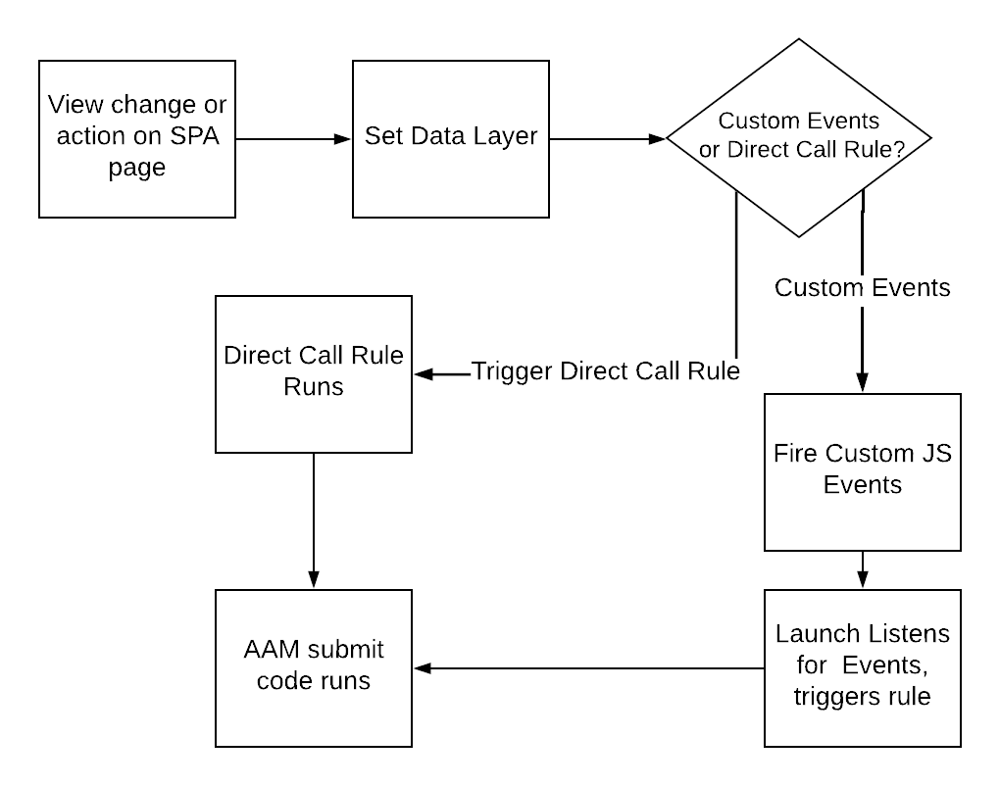

# Använd bästa praxis SPA sidor när du skickar data till AAM {#using-best-practices-on-spa-pages-when-sending-data-to-aam}

I det här dokumentet beskrivs flera metoder för att skicka data från ensidiga program (SPA) till Adobe Audience Manager (AAM). Den här artikeln fokuserar på att använda [!UICONTROL Experience Platform tags], den rekommenderade implementeringsmetoden.

## Inledande noteringar

* Objekten nedan förutsätter att du använder plattformstaggar för implementering på din webbplats. Det finns fortfarande anledning att tänka på om du inte använder plattformstaggar, men du måste anpassa dem till din implementeringsmetod.
* Alla SPA är olika, så du kan behöva justera några av följande objekt för att bäst uppfylla dina krav, men Adobe vill dela med dig av några bästa metoder som du behöver tänka på när du skickar data från SPA sidor till Audience Manager.

## Enkelt diagram över att arbeta med SPA och AAM i Experience Platform-taggar (tidigare Launch){#simple-diagram-of-working-with-spas-and-aam-in-experience-platform-launch}

>[!NOTE]
>Detta är som sagt ett förenklat diagram över hur SPA sidor hanteras i en Adobe Audience Manager-implementering (utan Adobe Analytics) med hjälp av plattformstaggar. Som du ser är det ganska rakt framåt. Det stora beslutet är hur du ska förmedla en vyändring (eller en åtgärd) till plattformstaggar.

## Utlösa taggar från SPA {#triggering-launch-from-the-spa-page}

Två av de vanligaste sätten att aktivera en regel i plattformstaggar (och därmed skicka data till Audience Manager) är:

* Ställa in anpassade JavaScript-händelser (se exempel [HÄR](https://helpx.adobe.com/analytics/kt/using/spa-analytics-best-practices-feature-video-use.html) med Adobe Analytics)
* Använda en [!UICONTROL Direct Call Rule]

I det här Audience Manager-exemplet använder du en [!UICONTROL Direct Call rule] i Platform-taggar för att utlösa träffen i Audience Manager. Som du kommer att se i nästa avsnitt blir detta användbart genom att ställa in [!UICONTROL Data Layer] till ett nytt värde, så att det kan hämtas av [!UICONTROL Data Element] i plattformstaggar.

## Demo {#demo-page}

Här är en liten sida som visar hur du ändrar ett värde i datalagret och skickar det till Audience Manager, som du kan göra på en SPA sida. Den här funktionen kan utformas för mer komplicerade ändringar. Du hittar den här demosidan [HÄR](https://aam.enablementadobe.com/SPA-Launch.html).

## Ställa in datalagret {#setting-the-data-layer}

När nytt innehåll läses in på sidan eller när någon utför en åtgärd på webbplatsen måste datalagret, som sagt, ställas in dynamiskt i huvudet på sidan BEFORE Platform-taggar anropas och kör [!UICONTROL rules]så att plattformstaggar kan hämta nya värden från datalagret och överföra dem till Audience Manager.

Om du går till demowebbplatsen som listas ovan och tittar på sidkällan ser du:

* Datalagret ligger i sidans huvud, före anropet till plattformstaggar
* JavaScript-koden i den simulerade SPA-länken ändrar [!UICONTROL Data Layer]anropar sedan plattformstaggar ( `_satellite.track()` ring). Om du använde anpassade JavaScript-händelser i stället för detta [!UICONTROL Direct Call Rule]är lektionen densamma. Ändra först [!DNL data layer]och anropa sedan plattformstaggar.

>[!VIDEO](https://video.tv.adobe.com/v/23322/?quality=12)

## Ytterligare resurser {#additional-resources}

* [SPA om Adobe forum](https://forums.adobe.com/thread/2451022)
* [Referensarkitektursajter som visar hur du implementerar SPA i plattformstaggar](https://helpx.adobe.com/experience-manager/kt/integration/using/launch-reference-architecture-SPA-tutorial-implement.html)
* [Använda vedertagna metoder för att spåra SPA i Adobe Analytics](https://helpx.adobe.com/analytics/kt/using/spa-analytics-best-practices-feature-video-use.html)
* [Demo-webbplats som används för den här artikeln](https://aam.enablementadobe.com/SPA-Launch.html)
